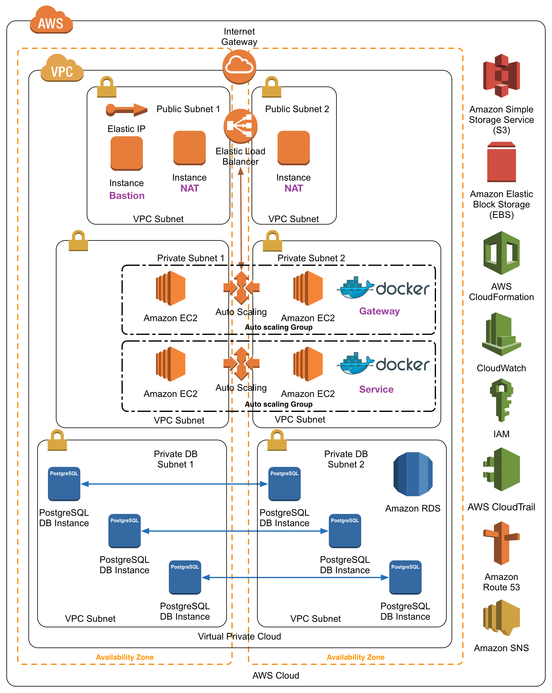

# Stax

## About

Stax creates and manages CloudFormation stacks (aka stax) in AWS ([Amazon Web Services](aws.amazon.com)).  Several CloudFormation templates are provided with stax, take a look at them in the `templates` directory to modify and create your own.

As an illustration, with the proper configuration and templates, `stax` can create a set of entities in AWS like those shown in the diagram below.



## Requirements

Stax requires Linux (tested on Debian GNU/Linux 7/8 and Ubuntu 14.04/15.04) and Apple OS X (tested on 10.09/10.10). You'll also need an account with [Amazon Web Services](aws.amazon.com).

### Homebrew (Mac OS X only)

Install [Homebrew](http://brew.sh/) for OS X, which '...installs the stuff you need that Apple didn’t'. Basically it's a \*nix package manager like we have in Linux.  It's easy to install via their setup script:

```
$ ruby -e "$(curl -fsSL https://raw.githubusercontent.com/Homebrew/install/master/install)"
```

Visit their site to learn how to install it manually if you don't trust that line.

### curl

Install [curl](http://curl.haxx.se/) if you don't already have it installed (OS X has it by default, and most Linux distros have it by default) on your client.

```bash
$ apt-get install curl   # Debian GNU/Linux, Ubuntu
$ yum install curl       # Red Hat Enterprise Linux (RHEL), CentOS, Amazon Linux
```

### awscli

Install [aws-cli](https://github.com/aws/aws-cli) (Universal Command Line Interface for Amazon Web Services) on your client.

NOTE: the version in the Debian repo is out of date, but we'll need the latest version, to get that we'll first need to install the Python package manager `pip`. These [install docs](http://www.cyberciti.biz/faq/debian-ubuntu-centos-rhel-linux-install-pipclient/] will help you get `pip` installed, once complete, go to the next step to install `awscli`.

```bash
$ pip install awscli  # Debian GNU/Linux, Ubuntu
$ brew install awscli     # Apple OS X ([via Homebrew](http://brew.sh/))
$ yum install awscli      # Red Hat Enterprise Linux (RHEL), CentOS, Amazon Linux
```

After installing the AWS CLI, you will need to configure it with your AWS access credentials, specifically an AWS API key and secret.  You can generate these credentials from your [IAM user page](https://console.aws.amazon.com/iam/home#users) on the AWS Console. Choose your username, scroll down to Security Credentials > Access Keys (Acess Key ID and Secret Access Key), and click Create Keys if you haven't created them yet.  Running stax requires many permissions in AWS, so be sure the IAM user you are running stax as has sufficient permissions, and in an admin group (called 'wheel' by default). If you already have this group, and your user is in that group, continue to 'aws configure' - otherwise follow the next steps to setup the 'wheel' group.

NOTE: if this is a new install (the AWS environment hasn't been used before) you'll need to create the wheel group, and add your user to that group for the user to have permissions to build on AWS.

* In the AWS Console, under the Services tab, choose IAM > Groups > Create New Group > Name it 'wheel' > Next Step > Create Group
* Now go into the group to define the 'Inline Policies'. Again, in the AWS Console, under the Services tab, choose IAM > Groups > Choose the new 'wheel' group > Scroll down to 'Inline Policies' and click on that > In that dropdown click 'click here' on the line that says "To create one, click here." - Now choose Custom Policy > Select > In 'Policy Name' call it 'wheel' then under Policy Document, enter the following:

```
{
  "Version": "2012-10-17",
  "Statement": [
    {
      "Effect": "Allow",
      "Action": "*",
      "Resource": "*"
    }
  ]
}
```

Click 'Apply Policy' - Now apply your user to that group, click Users > Click your new user > Click Add User to Groups > select the 'wheel' group > Click Add to Groups

Run the AWS configure utility to enter your keys and regions.

```bash
$ aws configure
```

You will be prompted to enter your access key and secret access key, copy this from the AWS Console you opened above.  Next you will be prompted to enter your AWS region, currently we have stax setup to use `us-east-1`.  Finally you will be prompted for the default output format, enter `json`.  The AWS CLI will store your configuration in `~/.aws/credentials`.  If you need to change your configuration, you can either run `aws configure` again or edit this file directly.

## Templates

Two templates are provided with stax to get you started, below are brief descriptions.

### simple.json

The template `template/simple.json` stands up a simple AWS environment.  Since it is simple to comprehend and spins up quickly, this template is intended as a sandbox to stand up and test new CloudFormation entities. For example, the implementation of CloudWatch Alarms was first tested using this template. The `config/simple.json` has minimal parameters and the default values are acceptable for all but the project/team parameters.

*   `Project` __REQUIRED__: Name for the project with which this application ecosystem is associated
*   `Product` __REQUIRED__: Name for the end-user facing product service by this application ecosystem
*   `Group` __REQUIRED__: Name of the group that created this stack
*   `Team` __REQUIRED__: Name of the team that created this stack
*   `Environment` __REQUIRED__: Type of environment, e. g., production, test, branch name
*   `KeepAlive` __REQUIRED__: Tag to avoid the reaper, default is false
*   `InstanceType`: AWS EC2 instance type for NAT instances, default is t2.micro
*   `Owner` __REQUIRED__: Tag for owner of the stack, if set to `@OWNER@` stax will substitute the current user id
*   `KeyName` __REQUIRED__: AWS EC2 Key Pair to use when launching instances, if set to `@KEY_NAME@` stax will use a key pair it creates
*   `SSHLocation`: CIDR IP range to allow SSH access to bastion host, if set to `@SSH_FROM@` stax will replace it with the CIDR IP of the host running stax, default is 0.0.0.0/0

### vpc-default.json

The template `template/vpc-default.json` creates an environment useful for deploying microservices as docker containers in AWS.  The following entities are created:

* __1 VPC__ (vpc-) Isolated Virtual Private Cloud network.
* __1 EC2 instance__ Bastion Host (bastion-) Provides SSH access to
  the VPC.
* __2 EC2 instances__ NAT boxes (nat1-, nat2-) Proxy network
  connections to and from the internal CoreOS hosts to the public
  internet.  These instances log all traffic and monitor each other to
  ensure high availability.
* __2 Elastic Load Balancers__ Gateway ELB (gateway-elb-) Load balancer
  for service and web traffic to the Gateway Cluster
* __1 Auto Scaling Group__ Gateway Cluster (gateway-) An auto scaling
  group with a default size of 2 of instances running CoreOS.
  The instances serve as the gateway/router to the internal service
  instances.
* __3 EC2 Instances__ Service Leaders (service-leader-N-) Three
  instances with CloudWatch Alarms for auto-recovery should they fail
  that serve as the cluster leaders for etcd and consul.
* __1 Auto Scaling Group__ Service Cluster (service-) An auto scaling
  group with a default size of zero on which, along with the service
  leaders, all services deployed to the VPC will run.

The text in parentheses is the first part of the name given to the entity, with the latter part being the CloudFormation stack name.

This template takes the following parameters, see `config/vpc-default.json.example` for the format.

*   `Project` __REQUIRED__: Name for the project with which this
    application ecosystem is associated
*   `Product` __REQUIRED__: Name for the end-user facing product
    service by this application ecosystem
*   `Group` __REQUIRED__: Name of the group that created this stack
*   `Team` __REQUIRED__: Name of the team that created this stack
*   `Environment` __REQUIRED__: Type of environment, e. g., production, test, branch name
*   `KeepAlive` __REQUIRED__: Tag to avoid the reaper, default is false
*   `Owner` __REQUIRED__: Tag for owner of the stack, if set to `@OWNER@` stax will
    substitute the current user id
*   `KeyName` __REQUIRED__: AWS EC2 Key Pair to use when launching instances, if set
    to `@KEY_NAME@` stax will use a key pair it creates
*   `ServiceELBSubdomainName`: Route 53 subdomain, leave blank to not
    create one
*   `ServiceELBBaseDomainName`: Route 53 base domain name, leave blank
    to not create one
*   `ServiceELBSSLCertName`: IAM name of SSL existing certificate, leave
    blank to not use SSL
*   `DockerRegistryUser`: Private Docker registry user name
*   `DockerRegistryPass`: Private Docker registry password
*   `DockerRegistryEmail`: Private Docker registry email address
*   `DockerRegistryUrl`: Private Docker registry URL, defaults to https://index.docker.io/v1/
*   `ServiceClusterSize`: Target size of Service Cluster auto scaling
    group, default is 0
*   `GatewayClusterSize`: Target size of Gateway Cluster auto scaling
    group, default is 2
*   `BastionInstanceType`: AWS EC2 instance type for bastion host,
    default is t2.micro
*   `NATInstanceType`: AWS EC2 instance type for NAT instances, default
    is t2.micro
*   `DockerInstanceType`: AWS EC2 instance type for CoreOS/Docker hosts,
    default is m3.medium
*   `CoreOSChannelAMI`: CoreOS channel (stable, beta, alpha) to use for
    CoreOS instances, default is CoreOSStableAMI
*   `AdvertisedIPAddress`: Which instance IP address to use for
    clustering, private or public, default is private, use public to
    cluster across unpaired VPCs
*   `AutoScaleCooldown`: Auto scaling cooldown period, in seconds, after
    an auto scaling event, default is 300
*   `AllowSSHFrom`: CIDR IP range to allow SSH access to bastion host,
    if set to `@SSH_FROM@` stax will replace it with the CIDR IP of the
    host running stax
*   `AllowHTTPFrom`: CIDR IP range from which to allow HTTP access to
    the Gateway ELB, if set to `@HTTP_FROM@` stax will replace it with
    the CIDR IP of the host running stax


## Usage

* To get started, first clone stax

```bash
$ git clone https://github.com/MonsantoCo/stax
$ cd stax
```

* Copy the example default config file

```bash
$ cp config/vpc-default.json.example config/vpc-default.json
```

* Configure the config file replacing all instances of `<changeMe>`.

```bash
$ vi config/vpc-default.json
```

* Run stax

```bash
$ ./stax
Usage: stax [OPTIONS] COMMAND [COMMAND_ARGS]

Options:
  -c,--config=CONFIG       Use file CONFIG rather than config/vpc-default.json
  -d,--debug               Turn on verbose messages
  -h,--help                Output this message
  -j,--jump=IP             SSH through host with IP address IP
  -m,--module=MOD          Use config/MOD.json and template/MOD.json
  -q,--quiet               Mute status messages
  -t,--template=TEMPLATE   Use file TEMPLATE rather than template/vpc-default.json
  -v,--version             Print name and version information
  -y,--yes                 Do not prompt for confirmation

If an argument is required for a long option, so to the short. Same for
optional arguments.

Commands:
  add                Add functionality to an existing VPC
  add-logger         Add logging functionality to an existing VPC
  auto-services      Lanch multiple services on fleet using a template/NAME.services file
  check              Run various tests against an existing stax
  connect [TARGET]   Connect to bastion|gateway|service in the VPC stax over SSH
  create             Create a new VPC stax in AWS
  describe           Describe the stax created from this host
  delete             Delete the existing VPC stax
  dockerip-update    Fetch docker IP addresses and update related files
  fleet              Run various fleetctl commands against the fleet cluster
  help               Output this message
  history            View history of recently created/deleted stax
  list               List all completely built and running stax
  rds PASSWORD       Create an RDS instance in the DB subnet
  rds-delete RDSIN   Delete RDS instance RDSIN
  remove ADD         Remove the previously added ADD
  services           List servers that are available to run across a stax
  slack              Post usage report to Slack, define hook in stax.config
  sleep              Turn on/off bastion host which allows ssh access into the VPC
  start SERVICE      Start service SERVICE in the fleet cluster
  test               Automated test to exercise functionality of stax
  update             Update an existing VPC with changes from Cloudformation
  validate           Validate CloudFormation template

For more help, check the docs: https://github.com/MonsantoCo/stax
```

* Create a stax cluster on AWS. __WARNING: This will cost you money!__

```bash
$ ./stax --config=config/vpc-default.json --template=template/vpc-default.json create
```

* Watch for any errors.

## Accessing the cluster

It will take ~5 minutes to build, you can test if it's ready by trying
to connect.

```bash
$ ./stax connect
```

The command will check if the cluster is built, and if it is, it will
populate the bastion host with needed information and then connect you
to it.

* You can access specific hosts in the Gateway Cluster and Service Cluster using the following commands:

```bash
$ ./stax connect gateway[N]
$ ./stax connect service[N]
```

* You can get information about the fleet cluster with the `fleet` command:

```bash
$ ./stax fleet
```

* You can test the general operation of the stack with the `check` command:

```bash
$ ./stax check
```

* You can get a list of service stax knows how to deploy with the following command:

```bash
$ ./stax services
```

* You can deploy one of those services using the start command:

```bash
$ ./stax start SERVICE
```

replacing `SERVICE` with the name of the service you want to deploy.
The service deployment is done using `fleet`.

* You can create a PostgreSQL RDS instance with the following command:

```bash
$ ./stax rds PASSWORD
```

replacing `PASSWORD` with a password you will need to connect to the
database.

## Destroying the cluster

To delete the stack and the other entities stax creates as part of its management, e. g., the S3 bucket, EC2 Key Pair, and RDS instances, run the following command: 

```bash
$ ./stax delete
```

## stax.config

An optional customization configuration file is available at `config/stax.config`, which allows you to specify option parameters for your stax. Currently the file allows customization of the prefix stax uses to name your stax, an ssh jumpbox you might have to proxy through to get to your stax, and integration with [Slack](https://slack.com/).

```
## stax.config - optional parameters specific to your environment

# the prefix for the name of your stax, default is "stax"
STAX_TAG_PREFIX=""

# the IP of a ssh 'jumpbox' to proxy SSH connections to your VPC
STAX_JUMP=""

# the webhook URL to allow stax to post to a slack channel (#stax by default)
# see https://slack.com/services/ for setup documentation
STAX_SLACK_WHOOK=""
```

* To install stax.config

```
cp config/stax.config.example ~/.stax.config
```

* Edit the contents of `~/.stax.config` and enter your values

Now, running stax will see that file and source it, using the found variables over any others in the `config` directory.

## Acknowledgements

The stax project started off with ideas from the following projects:

* [emmanuel/coreos-skydns-cloudformation](https://github.com/emmanuel/coreos-skydns-cloudformation)
* [xueshanf/coreos-aws-cloudformation](https://github.com/xueshanf/coreos-aws-cloudformation)
* [kelseyhightower/kubernetes-coreos](https://github.com/kelseyhightower/kubernetes-coreos)

Thanks everyone, Open Source FTW!

## License

```
# Modified BSD License

Copyright (c) 2015, Monsanto Company
All rights reserved.

Redistribution and use in source and binary forms, with or without
modification, are permitted provided that the following conditions are met:
    * Redistributions of source code must retain the above copyright
      notice, this list of conditions and the following disclaimer.
    * Redistributions in binary form must reproduce the above copyright
      notice, this list of conditions and the following disclaimer in the
      documentation and/or other materials provided with the distribution.
    * Neither the name of the Monsanto Company nor the
      names of its contributors may be used to endorse or promote products
      derived from this software without specific prior written permission.

THIS SOFTWARE IS PROVIDED BY THE COPYRIGHT HOLDERS AND CONTRIBUTORS "AS IS" AND
ANY EXPRESS OR IMPLIED WARRANTIES, INCLUDING, BUT NOT LIMITED TO, THE IMPLIED
WARRANTIES OF MERCHANTABILITY AND FITNESS FOR A PARTICULAR PURPOSE ARE
DISCLAIMED. IN NO EVENT SHALL MONSANTO COMPANY BE LIABLE FOR ANY
DIRECT, INDIRECT, INCIDENTAL, SPECIAL, EXEMPLARY, OR CONSEQUENTIAL DAMAGES
(INCLUDING, BUT NOT LIMITED TO, PROCUREMENT OF SUBSTITUTE GOODS OR SERVICES;
LOSS OF USE, DATA, OR PROFITS; OR BUSINESS INTERRUPTION) HOWEVER CAUSED AND
ON ANY THEORY OF LIABILITY, WHETHER IN CONTRACT, STRICT LIABILITY, OR TORT
(INCLUDING NEGLIGENCE OR OTHERWISE) ARISING IN ANY WAY OUT OF THE USE OF THIS
SOFTWARE, EVEN IF ADVISED OF THE POSSIBILITY OF SUCH DAMAGE.
```

## Stax Studio

Stax, besides being a clever take on the word stacks, is named after
the famous Stax Recording Studio in Memphis, TN. If you're ever in
Memphis, visit the awesome
[Stax Museum](http://www.staxmuseum.com/)... it's far more interesting
than Sun Studios, but I digress.


